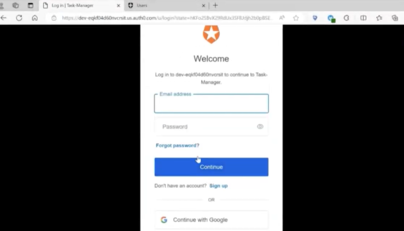
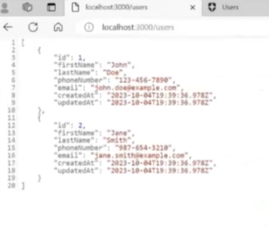
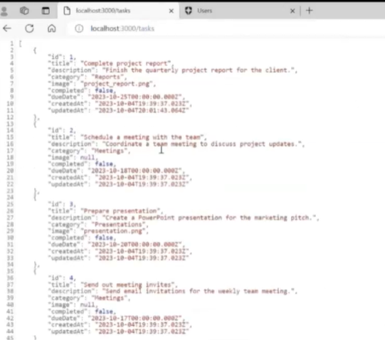

## Backend Project - Task Manager
### High-level overview of the project purpose
The Task Manager application is a simple backend task storage app where users log into their individual profile and can store tasks they need to complete and mark them complete once done.

### Situation
When displaying the application, the default is that you are "logged out" and a small message showing "Logged out" is displayed. By navigating to the apps URl/login, a user interface from OAuth is shown where are user profiles are handled. The user can log in and the tasks associated with that user are displayed. 

### Task
So before building, we all discussed how we would store tasks and how the app would be accessed. We decided that the tasks would be stored in an API and users could access their own tasks(their "API) through an authentication service. When developing the app we decided it would be completely backend focused. 

### Action
So in developing the application after planning, we created a few example APIS and set up CRUD fucntionality to access, read, and post information. Then the Oauth functionality was added and assigned to individual APIs so that certain tasks can only be accessed by certain users.

### Result

As a result, the task manager is a backend application allowing users to authenticate through a log in, then view/store their tasks.

Here are some images of our project.

Pictured above is where our users could log into their account to view their stored tasks.

Pictured above is our stored users when navigating to /users

Pictured above is a user's stored tasks when navigating to /tasks

## Technologies
- Javascript
- CSS
- PUG
- OAuth
- API

## Competencies
### JF 3.7 - Can implement authentication and authorization to an API. 
- In my job, I have practiced this competency in being in charge of the backend onboarding process for a service we use called SAP Workzone. I use user information to help them create a "profile" authenticating them to access restricted information once they are verified and logged in.
- Through this project, I have demonstrated this competency with my team by connecting our created APIs to individual user accounts. We used a third party service called OAuth to enable this and it handles and stores our users while we only have to connect to user functionality
- This competency helps me to understand the importance behind authentication practices in protecting user information and its benfits in controlling content for applications. I also learned how third party services can be used to apply authentication for users.

### JF 1.5 - Can work effectively and contribute appropriately on a team to produce software 
- I have demonstrated this competency on the job in working with my team members directly to create and develop processes in our supply chain organization. In my role, I am a developer so I get to collaborate with business and communication teams to create the solution according to business need.
- This compentency is practiced in this project directly with my team. We were able to all contribute our skills to the overall project by assigning roles and assisting one another to join our individual contributions together seamlessly.
- To make sure we handled this requirement well, we assigned roles using the issue tab in our repo and creating our own branches that when ready to be pushed, was reviewed and then commited by a seperate team member.

## Challenges
- This was the first big group project I worked on through this apprenticeship so their were some obstacles to overcome such as version control, branch merging and time management. To overcome both version control and brach merging, we decided to all create a basic file set up first and pull it to our local machines. Once that was done, we all created our own branches and assigned tasks using github actions. We all worked on our individual tasks and collaborated when it was neccessary to bring certain changes together. When we were happy with the changes we pushed the changed code to our branch, then had another team member review and merge to the main branch. When dealing with time management, we ran into the issue of different schedules and finding time to collaborate. To overcome this, we tried to create dedicated times to work on our individual tasks then collaborated on a time to meet together. Assigning tasks in the repo issues tabs also helped with this as each team member knew what they were assigned to and how it tied into the overall project.
