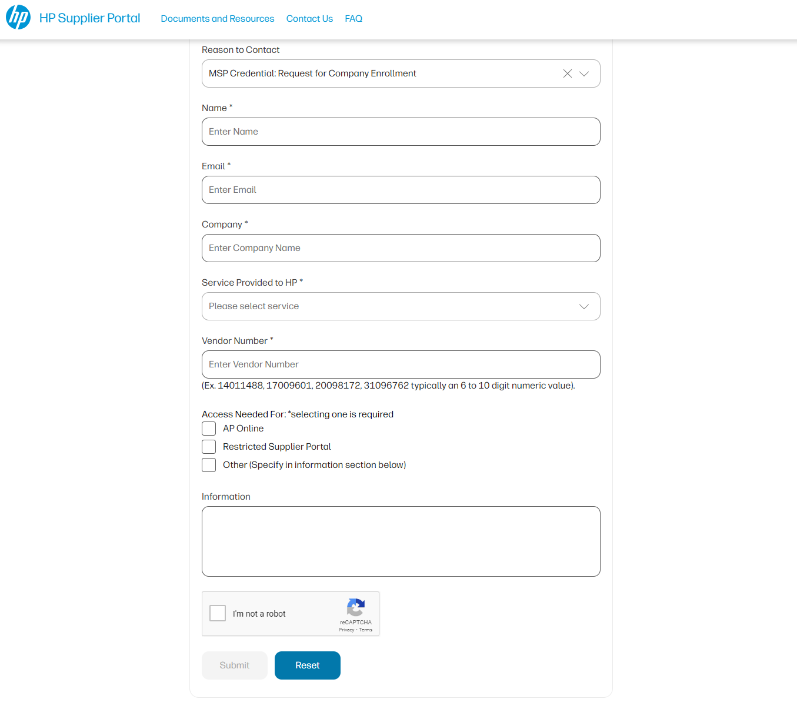

## Front End Project - Weather App
### High-level overview of the project purpose
Through this project, I was able to create a feature for an application on the job that directly impacts usability for HP Supplier Portal. Our suppliers at HP can send a contact form to the necessary business teams to onboard onto our new security platform.

### Situation 
The MSP Credential Form is a formal way for HP Suppliers to request a security credential to log into supplier tools on a website called HP Supplier Portal. Once a supplier has filled out the form, an email is sent to the corresponding team based on the information given.
This Application was created as a means of solving an issue where some companies who were not yet verified with HP could request verification to our Indirect and Direct Procurement teams.

### Task 
Before building the program, I new it needed to fit seamlessly into the application by designing at close to the smae design as the application's other forms. I reviewed the code for these other forms and used the same deisgn platform- Veneer- to make sure all CSS styling was the same. I then spoke with our business team to understadn what information was important to include as queries and blanks for the user to fill in to ensure all needed information was given to business teams to assist our users. Once I had this information I began writing the form's code. The form inclues a front end that user interacts with an fills in blanks or chekcnoxes, a backend where that info is processed and checked for accuracy and correctness, and the deployment side where the form is checked for compatibility and uploaded to our servers.

### Action
On the front end, I used similar code to past forms, so I could review that code and edit it to this form's needs. I used Veneer to add other components neccessary such as checkboxes or choices. On the backend, I created validation files that checked the users answers on the form such as a valid email, ID or having no empty values. I also created connections to send emails to the proper business team depending on how the form was answered. For deployment, I used our applications main deployment tools; Putty, WinSCP, and AWS to first review the changes in our test environment then push into our production servers if all the changes were accepted.

### Result
Here is a picture of the deployed form on the website.

## Technologies
- React
- Javascript
- HTML
- CSS
- Express
- NodeJS
- -Veneer

# Challenges
- Integration: I ran into challenges integrating a new feature into already existing code. Luckily I was able to use already existing features to understand the organization of files and use the same logic in the new features.
- Problem solving: Another obstacle I overcame were small errors that were causing the entire form to not work correctly. I decided to go through the file logic in order until I was able to fins where the error was taking place. I was also able to use the error messages to find the exact area that needed revision.
