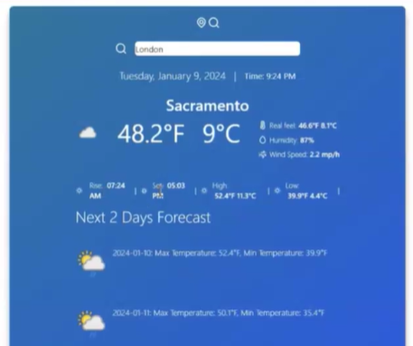

## Front End Project - Weather App
### High-level overview of the project purpose
This application is a weather app where users can see their weather local current weather and forecast as well as global locations. The app also displays some other details such as the temperature in farenheit and celsius, humidity, that day's high and low temperature and wind speed.

### Situation
My Team decided to create this project to pratice our skills in creating a front end application using information provided by an API. The application is a basic weather app that uses a third party live API to track weather and location data.

### Task
When opening our app, the browser will prompt you to allow "location sharing". If allowed the main page will display. This is a paage that shows the name of your approximate location, the wether asnd temperature, the days humidity and high an dlow temperature as well as wind speeds. Below this you can also find the forecast for temperature and weather for the next 2 days. We have also added functinality to see a random locations weather data. When the user selcts the "location marker" image, a random location is chosen from the API and then the same info that shows for yur local location is displayed for the random location.

### Action
When designing this application, we looked for a proper API that would provide all the information we wanted to display within our app. It took some time and trial and error to figure out APIs that accomplished this goal without hidden fees. Once we found it, we began assigning tasks for who would create what and what parts we woud be in charge of. We decided on a basic one page react app that could display dynamically. We began with backend tasks first, connecting out API to the code. Then we created basic UI display to test that the needed information would show up. Once we neew we could diplay our API info, we designed more complex designs to create the site that is pictured in the results section.

### Result
As a result, users of this application can navigate to our site and view theirs location's weather details and also select a button to view a random location's weather information.

Here is a picture of our deployed project.

## Technologies
- React
- Javascript
- HTML
- CSS
- APIs
- NodeJS

## Competencies
### JF 6.6 - Shows initiative for solving problems within their own remit, being resourceful when faced with a problem to solve
- I have practiced this competency on the job in my day to day work being a self taught programmer. I sometimes run into code problems I hsave never encountered so in these cases I do one of two things; breakdown the problem or research. When "breaking down the problem" I take the high level issue and break into smaller steps. This allows me to go through each of the smaller steps until I pinpoint the error. For research, I find it most helpful to look for documentation for the particular coding language or technology. Most problems or projects I am trying to create can easily be found in this documentation. I also look into other developers working or having worked on similar tasks.
- When working on this project I practiced this competency in team building. When creating the application, our team wanting to include a search funtion to look for a particular locaation within the API. We tried many different solutions in trying to get the functionality to work but could ot find a solution within the time constraint. Therefore, I figured out a work around to still fully utilize the APIs info in the form of the Weather App's "random location" functionality.
- This competency expanded my learning in the importance of good problem solving skills. Knowing when to research, ask for help, or expasnd further upon and error or problem to understand it fully.

# Challenges
Unlike our task manager group project, this project required us to create a front and backend, which made collaboration more complex. To over come this, we once again utlized github actions, except this time we made our job roles/tasks more detailed and numerous for clarity. This also required more collaboration time tom ake sure all pieces fit together smoothly and there was someone to review merges to our main branch. In this case instead of meeting altogether each time, the two or three team members who needed to collaborate to fit their code pieces together met seperately to avoid delay in completing cetain parts. We also did some parts in a specific order to avoid complications in the merging process so that one member would not have to change major pieces of code they've already worked on.
